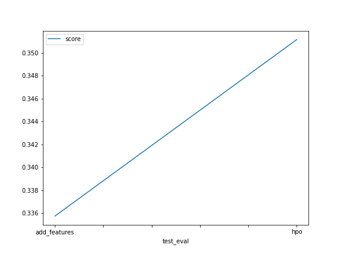
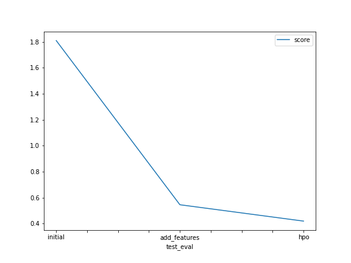

# Report: Predict Bike Sharing Demand with AutoGluon Solution
#### Qi Wang

## Initial Training
### What did you realize when you tried to submit your predictions? What changes were needed to the output of the predictor to submit your results?
Negative values are not accepted.

### What was the top ranked model that performed?
WeightedEnsemble_L3

## Exploratory data analysis and feature creation
### What did the exploratory analysis find and how did you add additional features?
1. Datatime column includes year, month, day, hour data that can be sperated. So I create seperate month and hour values
2. season and weather are identified as int variable. I changed it to categorical data
3. predict casaul and registered sperately
4. change response variable to log(x+1) to match offical scoring approach
5. add rush hour, and add good date

### How much better did your model preform after adding additional features and why do you think that is?
Decrease from 1.81 to 0.546. Demand depends on the time of the day, wether it is rush hour or not.  

## Hyper parameter tuning
### How much better did your model preform after trying different hyper parameters?
TODO: Add your explanation

### If you were given more time with this dataset, where do you think you would spend more time?
feature engineering

### Create a table with the models you ran, the hyperparameters modified, and the kaggle score.
|model|hpo1|hpo2|hpo3|score|
|--|--|--|--|--|
|initial|?|?|?|1.81|
|add_features|?|?|?|0.546|
|hpo|?|?|?|0.420|

### Create a line plot showing the top model score for the three (or more) training runs during the project.

### Create a line plot showing the top kaggle score for the three (or more) prediction submissions during the project.

## Summary
Adding feature, separating model to predict causal and registered, and tunning parameters all works to increase the prediction power.
